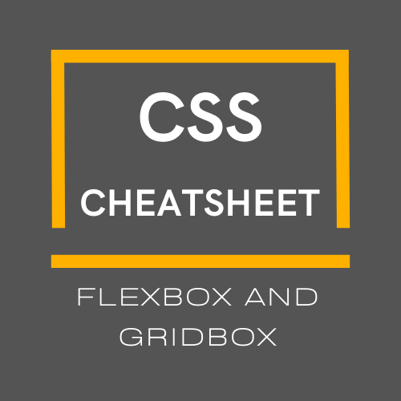
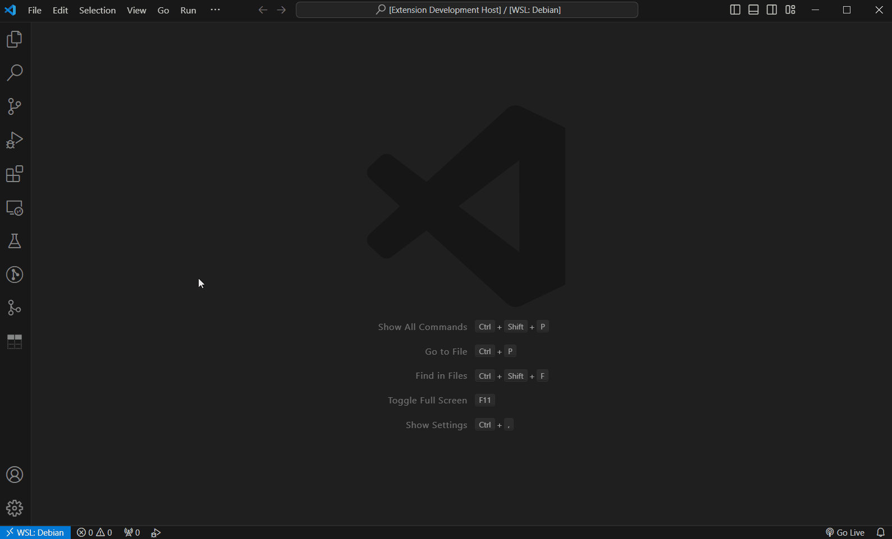
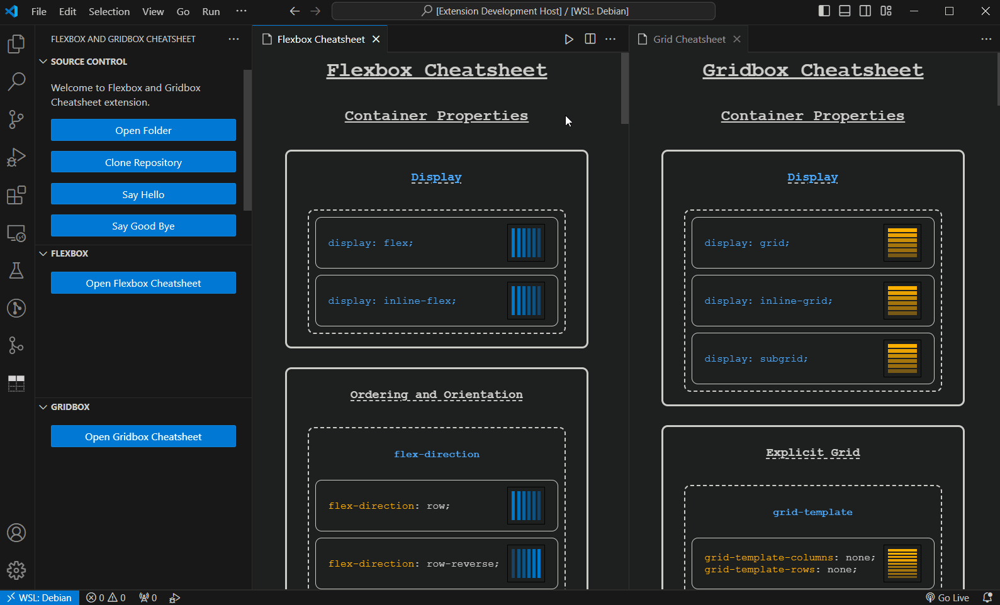

# **Flexbox and Gridbox CheatSheet**

## _Copy and paste quickly, then look at the icons_

_**"Flexbox and Gridbox CheatSheet"** is a visual and easy way to look up CSS rules and copy some of them to the clipboard._

Index

---

- [Features](#features)

---

## Features

- Use the extension **icon** or the **command** `>open Flexbox and Gridbox Cheatsheet`:

👀 **Icon option**:

👀 **Command option**:

- Choose between the **"Flexbox"** or **"Gridbox"** CheatSheet.

- **Consult the documentation** to learn more about an element:

- **Copy the code** to the clipboard:

